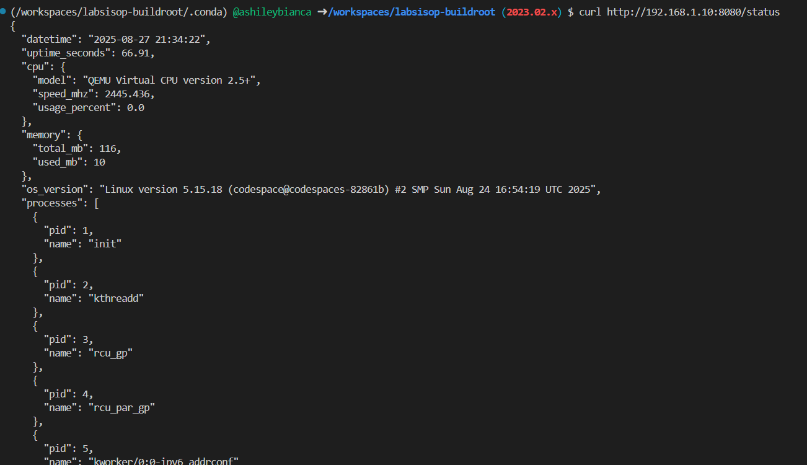
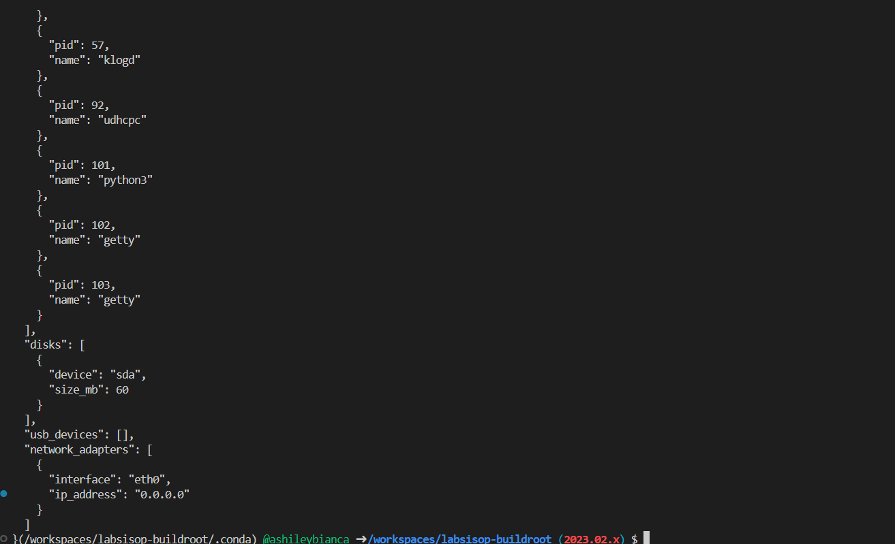
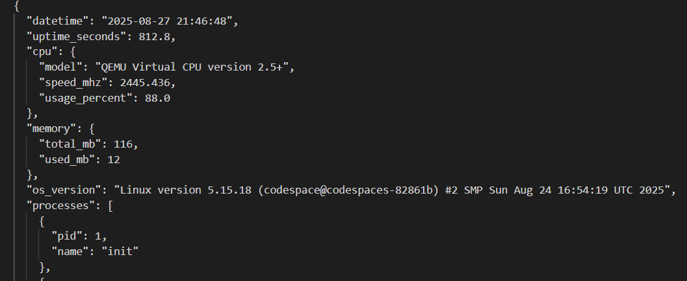
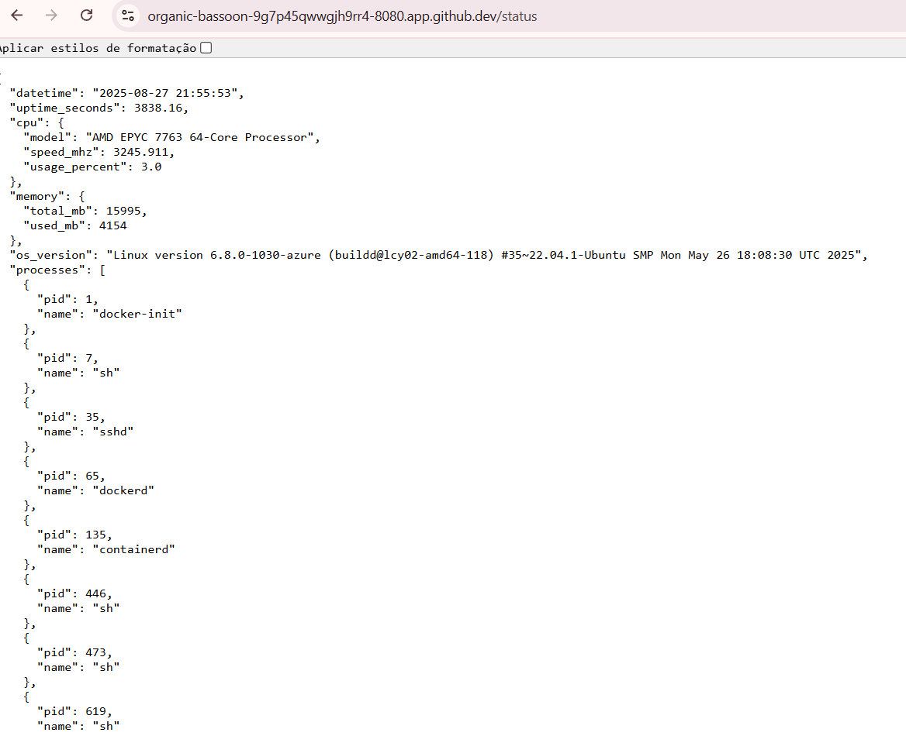

# Descrição do funcionamento básico do programa

### Ativação do Python no Buildroot
No menu do Buildroot:
Target Packages -> Interpreter languages and scripting -> [*] python3


### Arquivo Python principal

Crie um arquivo `systeminfo.py` na raiz do projeto Codespaces (root) com as funções implementadas.


### Script de inicialização no target

Crie um arquivo `S51systeminfo.sh` dentro de `custom-scripts/`:

```bash
#!/bin/sh
case "$1" in
    start)
        /usr/bin/python3 /usr/bin/systeminfo.py & exit 0
        ;;
    stop)
        exit 1
        ;;
    *)
        exit 1
        ;;
esac
exit 0
```

### Configuração do pre-build

No `pre-build.sh`, adicione:

```bash
cp $BASE_DIR/../custom-scripts/S51systeminfo.sh $BASE_DIR/target/etc/init.d
chmod +x $BASE_DIR/target/etc/init.d/S51systeminfo.sh
```

### Copiando o script Python para o target

> cp systeminfo.py output/target/usr/bin/

> chmod +x output/target/usr/bin/systeminfo.py

### Compile:

> make

### Inicie a target no QEMU:

> ./start_qemu.sh

### Teste na host

Faça uma requisição HTTP para o endpoint `/status`:

> curl http://192.168.1.10:8080/status


Você deve receber o payload JSON contendo as informações do sistema.

# Capturas de tela (screenshots) das respostas obtidas pelo endpoint /status






Na máquina target rodamos um comando para produzir uso da CPU e poder capturar o CPU usage.

O comando foi: `sh -c 'while :; do for i in $(seq 1 100000); do :; done; sleep 0.1; done'`

Como pode ser observado na figura abaixo, foi possível capturar o uso da CPU:



Um exemplo na máquina do CodeSpaces:





# Explicação de como cada informação exibida é obtida a partir de /proc e /sys

## datetime

[How can I get system time from a proc file?](https://stackoverflow.com/questions/5242296/how-can-i-get-system-time-from-a-proc-file)
[Real Time Clock (RTC) Drivers for Linux](https://docs.kernel.org/admin-guide/rtc.html)

O datetime pode ser encontrado através do comando:

```bash
cat /proc/driver/rtc
```

No nosso target Buildroot, o arquivo `/proc/driver/rtc` não existe, então não podemos obter a data/hora diretamente do RTC.
Então usamos uma solução alternativa para calcular o datetime usando o `btime` do `/proc/stat` que contém o timestamp do boot em segundos desde 1970 (Unix time) e o `/proc/uptime` que é o uptime do sistema. Somamos btime + uptime e conseguimos o timestamp atual do sistema convertendo o em data e hora legível através da biblioteca `time` do Python, que faz parte da Standard Library.


## uptime_seconds

[The /proc Filesystem](https://docs.kernel.org/filesystems/proc.html)

O uptime (tempo que o sistema está ativo) pode ser encontrado através do comando:

```bash
cat /proc/uptime
```

Ele é o primeiro valor a ser exibido, enquanto o segundo é o tempo que o sistema ficou ocioso.

## cpu
[The /proc Filesystem](https://docs.kernel.org/filesystems/proc.html#cpuinfo)

O modelo e a frequência da CPU são obtidos através do comando:

```bash
cat /proc/cpuinfo
```

Para o uso da CPU (percentual) não existe um comando direto, ele é calculado lendo os tempos de atividade da CPU usando o comando:

```bash
cat /proc/stat
```

## memory
[The /proc Filesystem](https://docs.kernel.org/filesystems/proc.html#meminfo)

Informações de memória total e memória usada:

```bash
cat /proc/meminfo 
```
Extraimos os valores de memória total, livre, buffers, cache, memória recuperável e compartilhada, e calculamos a memória usada com base em uma aproximação comum:
used_kb = total_kb - free_kb - buffers_kb - cached_kb - sreclaimable_kb + shmem_kb

Por fim, Os valores são convertidos de kilobytes para megabytes: used_mb = used_kb /1024

## os_version

[The /proc Filesystem](https://docs.kernel.org/filesystems/proc.html)

A versão do sistema operacional pode ser encontrada através do comando:

```bash
cat /proc/version
```

Ou também:

```bash
cat /proc/version_signature
```

Dado o exemplo de retorno, usamos o primeiro arquivo ```/proc/version``` para montar a versão.
Ele detalha versão do kernel e detalhes de compilação do sistema.

## processes

[Viewing the processes on your Unix systems through the eyes of /proc](https://www.networkworld.com/article/930606/unix-viewing-your-processes-through-the-eyes-of-proc.html)

A lista de processos do Sistema Operacional é obtida percorrendo os diretórios **dentro** de `/proc` que possuem nomes numéricos (cada um correspondendo a um PID).

Para cada PID, existe o arquivo `comm`, com o nome do processo.

```bash
cat /proc/<pid>/comm
```

A função `get_process_list()` retorna uma lista de objetos JSON contendo `pid` e `name`.

## disks

[Significance of /sys/block/sd*/sd*/size](https://unix.stackexchange.com/questions/502682/significance-of-sys-block-sd-sd-size)

A lista de dispositivos de armazenamento é obtida a partir de `/sys/block`. Para cada entrada que não seja RAM (`ram*`), lemos o arquivo `size`, que contém o número de setores do disco.

```bash
cat /sys/block/<device>/size
```

O código converte os setores para bytes (assumindo setores de 512 bytes) e depois para megabytes, conforme especificação. A função `get_disks()` retorna uma lista de objetos JSON contendo `device` e `size_mb`.

## usb_devices

[usb-devices(1) — Linux manual page](https://man7.org/linux/man-pages/man1/usb-devices.1.html)

Os dispositivos USB são obtidos a partir de `/sys/bus/usb/devices`. Para cada dispositivo, verifica se existem arquivos `product` ou `manufacturer` e combina essas informações em uma descrição.

```bash
ls /sys/bus/usb/devices/
```

A função `get_usb_devices()` retorna uma lista de objetos JSON contendo `port` e `description`.

*Obs: Na máquina target em execução no GitHub Codespaces, não haverá conexões USB.

## network_adapters

[Docs of /sys/class/net](https://www.kernel.org/doc/Documentation/ABI/testing/sysfs-class-net)

[E.3.7. /proc/net/](https://docs.redhat.com/en/documentation/red_hat_enterprise_linux/6/html/deployment_guide/s2-proc-dir-net)

As interfaces de rede são obtidas a partir de `/sys/class/net`. Para cada interface, o código lê `/proc/net/route` para encontrar a rota associada e converte o endereço IP de hexadecimal para o formato `X.X.X.X`.

```bash
ls /sys/class/net
cat /proc/net/route
```

A função `get_network_adapters()` retorna uma lista de objetos JSON contendo `interface` e `ip_address`.
